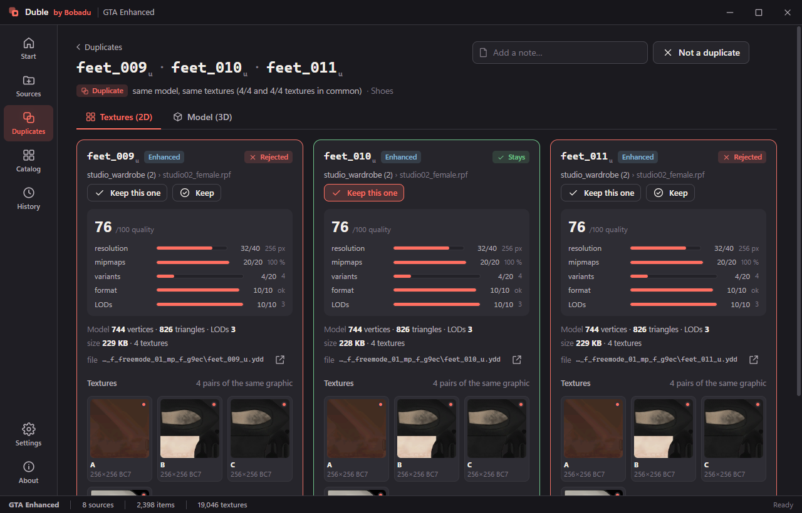
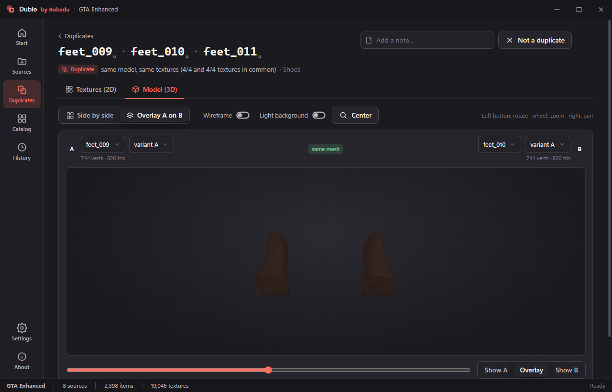
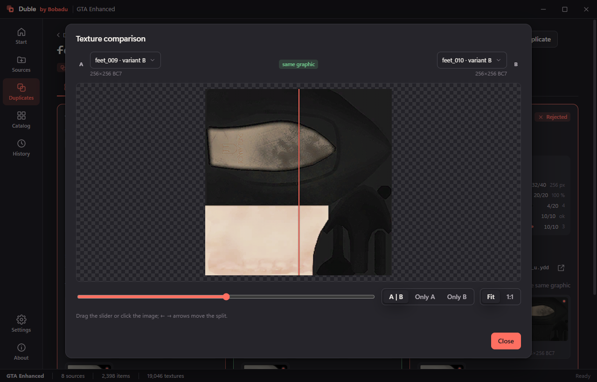
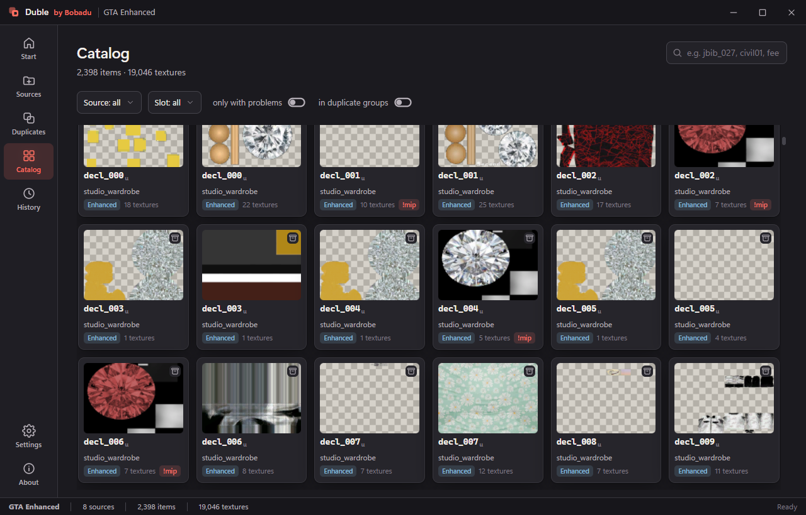
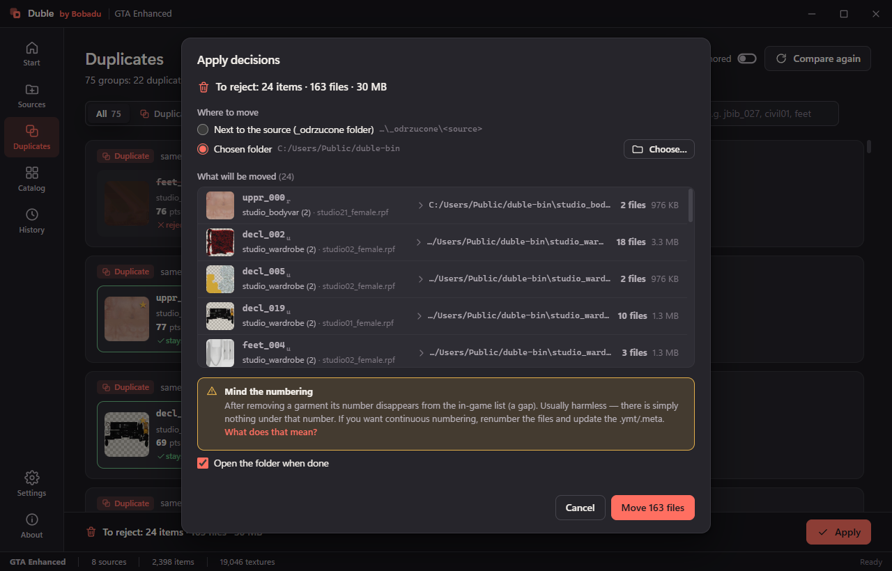

<div align="center">


# Duble

Duplicate clothing finder for GTA V mod packs.

[](https://github.com/Bobadu/duble/actions/workflows/build.yml)
[](https://github.com/Bobadu/duble/releases/latest)
[](https://github.com/Bobadu/duble/releases)
[](LICENSE)
[](https://github.com/Bobadu/duble/releases/latest)

[Download](https://github.com/Bobadu/duble/releases/latest) ·
[Website](https://qorion.net/duble) ·
[How comparison works](docs/how-it-works.md)

</div>


Duble reads clothing packs for GTA V (folders, `.rpf` archives and FiveM resources) and finds garments that are
the same model with the same textures. It shows the candidates side by side in 2D and 3D, proposes which copy to
keep, and moves the rejected files to a bin folder. Nothing is deleted, every operation can be undone, and `.rpf`
archives are opened read-only.

Both game formats are supported: GTA V Legacy (`.ydd` v165 / `.ytd` v13) and Enhanced, also called gen9
(v159 / v5).

## Verdicts

| Verdict | What it means | Proposed for removal |
|---|---|---|
| Duplicate | Same model, same textures | Yes, all but the best copy |
| Duplicate (superset) | Same model, one texture set contains the other | Yes, the smaller set |
| Needs review | Similar model or partial texture overlap | No, you decide |
| Retexture | Same model, different textures | Never, it is a separate garment |

Each verdict carries the numbers behind it: how many textures matched on each side and how far apart the models
are. [docs/how-it-works.md](docs/how-it-works.md) explains the fingerprints and where the thresholds come from.

## Requirements

- Windows 10 or 11, 64-bit
- [WebView2 runtime](https://developer.microsoft.com/microsoft-edge/webview2/), preinstalled on Windows 11 and on
  most Windows 10 machines; Duble links to it if it is missing
- No GTA V installation required, Duble works on the pack files

## Install

Download `Duble.exe` from the [latest release](https://github.com/Bobadu/duble/releases/latest) and run it. It is
a single self-contained file of about 60 MB, with no installer. The executable is not code signed, so SmartScreen
asks for confirmation on the first run (More info → Run anyway). Every release publishes a `Duble.exe.sha256`
checksum next to the binary.

Settings live in `%AppData%\Bobadu\Duble\`, projects default to `Documents\Duble\`.

## Using it

1. **New project.** A `.duble` file holds your sources, comparison results and decisions. The `.duble.cache`
   folder next to it holds thumbnails and previews and can be deleted at any time.
2. **Add sources.** A folder of packs, a single `.rpf` file or a FiveM resource. Drag and drop works, and
   *Find games* locates an installed GTA V. *Index all* reads models and textures and compares everything;
   later runs only re-read the files that changed.
3. **Review the duplicates.** Groups carry a verdict and a reason. Open one for the full comparison.
4. **Apply.** The dialog lists every file that will move and where to. Indexing and comparison then run again.
5. **Undo if needed.** History keeps every apply and restores all of it, or a single item.

### Comparison card



Every candidate gets a quality score out of 100 with a visible breakdown: texture resolution, mipmaps, colour
variants, texture format and LOD levels. The highest score is proposed as the one to keep. The decision stays
yours: *Keep this one*, *Reject*, *Not a duplicate*, plus a note.

### Model (3D)



Models can sit next to each other with a synchronised camera, or overlap with an A to B blend slider. In a group
of three or more you choose which two to compare, and a badge appears when the meshes are identical.

### Texture comparison



Textures open in a wipe comparison with a movable split, the colour variant of each side, its size and format,
and a badge when both sides are the same image pixel for pixel.

### Catalog



Every indexed garment in one grid, filtered by source, slot, game format, membership in a duplicate group, or
problems worth fixing such as textures without mipmaps and BC1 with alpha.

### Apply



Applying moves files to a bin, either `_odrzucone` next to the source or a folder you pick. Files shared with a
garment that stays are left alone, and files inside `.rpf` archives are skipped because archives are read-only.
*Sources → Unpack to folder* produces a writable copy of an archived pack.

Removing a garment leaves a gap in the game's slot numbering, for example a missing `jbib_001`. That is harmless
in game, but the pack's `.ymt` or `.meta` still lists the old numbering, so rebuild it with the tool the pack was
made with.

## Also included

- HTML report with thumbnails, and CSV export
- Unpacking an `.rpf` source into a folder of RSC7 files, like an OpenIV or CodeWalker export
- Calibration: comparison thresholds measured on your own catalog and drawn as distribution charts
- Polish and English interface, light and dark theme
- No telemetry, no account, no network access

## Build from source

```powershell
git clone --recurse-submodules https://github.com/Bobadu/duble
```

Open `Duble.sln` in Visual Studio or Rider and build. The only external dependency,
[CodeWalker](https://github.com/dexyfex/CodeWalker), is a git submodule in `external/CodeWalker` pinned to one
commit. Run `Duble.App` with the *Duble (developer mode)* profile to load the interface from `Duble.App/ui`,
which puts HTML, CSS and JS changes one page reload away.

The same from a terminal:

```powershell
dotnet build Duble.sln -c Release
dotnet test Duble.Tests -c Release
dotnet publish Duble.App -p:PublishProfile=win-x64   # -> publish\Duble.exe
```

The same work is available from a terminal. `duble help` lists the commands and `duble help <command>` says
what one accepts; the catalog is persistent, so every pack you index is compared against everything indexed
before it.

```powershell
dotnet run --project Duble.Cli -- index C:\packs\civil01 C:\packs\civil02
dotnet run --project Duble.Cli -- compare
dotnet run --project Duble.Cli -- report --lang en
```

Working files go to a `duble` folder in the current directory, or wherever `DUBLE_HOME` points. To get `duble`
itself as a command: `dotnet pack Duble.Cli` then `dotnet tool install --global --add-source ...`.

| Project | Contents |
|---|---|
| `Duble.Core` | Engine: indexing, fingerprints, comparison, decisions, apply and undo, report, unpacking |
| `Duble.App` | WPF and WebView2 shell; the interface lives in `Duble.App/ui` (HTML, CSS, JS, three.js) |
| `Duble.Cli` | Command line: `duble index / compare / report / apply / undo / calibrate`, and tools for one file |
| `Duble.Tests` | xunit tests; the ones that need real packs skip themselves when the data is absent |

Pull requests are welcome. [CONTRIBUTING.md](CONTRIBUTING.md) has the house rules, [CHANGELOG.md](CHANGELOG.md)
records what changed when, and [SECURITY.md](SECURITY.md) explains how to report a vulnerability.

## Credits

[CodeWalker.Core](https://github.com/dexyfex/CodeWalker) by dexyfex reads `.rpf`, `.ydd` and `.ytd` files.
[BCnEncoder.Net](https://github.com/Nominom/BCnEncoder.NET) decodes BC7 textures.
[three.js](https://threejs.org) draws the 3D preview.

## License

[MIT](LICENSE) © 2026 Bobadu

The components Duble builds on keep their own licences — see [third-party notices](THIRD-PARTY-NOTICES.md).
