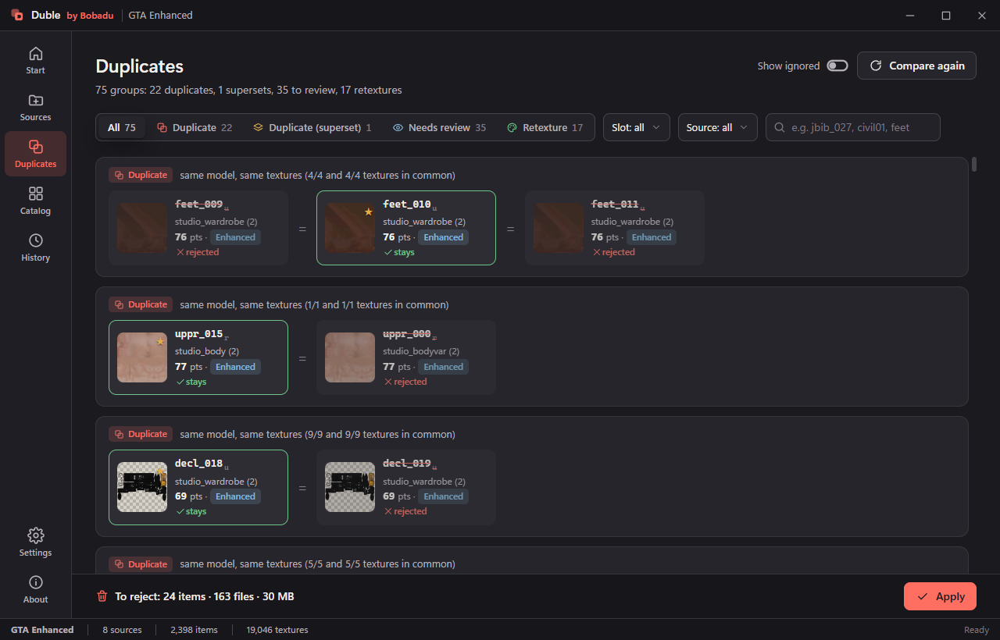

<div align="center">


# Duble

**Find duplicate clothing in GTA V packs — and clean it up without losing a file.**

[](https://github.com/Bobadu/duble/actions/workflows/build.yml)
[](https://github.com/Bobadu/duble/releases/latest)
[](https://github.com/Bobadu/duble/releases)
[](LICENSE)
[](https://github.com/Bobadu/duble/releases/latest)
[](https://dotnet.microsoft.com/download)

[Download](https://github.com/Bobadu/duble/releases/latest) ·
[Website](https://qorion.net/duble) ·
[How it works](docs/how-it-works.md)



</div>

---

Duble reads clothing packs for GTA V (folders, `.rpf` archives, FiveM resources), finds garments that are
**the same model with the same textures**, shows them side by side in 2D and 3D, and lets you decide which copy
to keep. Nothing disappears without your decision: rejected files are **moved** to a bin next to the source, and
one click (**Undo**) brings them back.

> **Rule #1: duplicate = same model + same textures.** The same model with a different texture is a
> **retexture** — a separate garment that Duble never proposes for removal.

## Why

Mod libraries grow by copying. The same jacket ends up in three packs under three numbers, a pack gets
re-released with two textures added, a "premium" bundle repeats half of a free one. Manually, the only way to
tell a duplicate from a retexture is to open both in OpenIV and stare at them. Duble does that comparison on
fingerprints — of the mesh and of every texture — and shows you the evidence instead of just a verdict.

## Features

- **Reads both game formats** — Legacy (`.ydd` v165 / `.ytd` v13) and Enhanced / gen9 (v159 / v5), plus FiveM
  resources and `.rpf` archives. BC1–BC5 and BC7 textures are decoded for previews and fingerprints.
- **Four verdicts, not one** — duplicate, duplicate (superset), needs review, retexture. Each comes with the
  numbers behind it (how many textures matched, how far apart the models are).
- **A quality score (0–100)** proposes which copy to keep — resolution, mipmaps, colour variants, texture format
  and LODs, with the breakdown visible so you can disagree.
- **Compare properly** — textures side by side with matching pairs linked, a full-size A/B view with a wipe
  slider, and a 3D tab: models next to each other with synchronised orbit, or overlaid with an A→B blend.
- **Nothing is deleted** — Apply *moves* files to a bin and writes History; Undo restores everything, or one
  item. Files shared with a garment that stays are never touched, and `.rpf` archives are opened read-only.
- **Catalog** of everything indexed, with filters (source, slot, format, "with problems", "in duplicate groups").
- **Reports** — a self-contained HTML report with thumbnails, and CSV.
- **Yours, offline** — Polish and English interface, light/dark theme, no telemetry, no account, no network.

## Install

1. Download `Duble.exe` from the [latest release](https://github.com/Bobadu/duble/releases/latest) — one
   file, ~60 MB, .NET included, no installer.
2. Run it. Windows SmartScreen warns about unsigned apps: **More info → Run anyway**. The first start takes a few
   seconds longer (the file unpacks itself into `%TEMP%\.net\Duble\`).
3. Requirements: Windows 10/11 (64-bit) and the
   [WebView2 runtime](https://developer.microsoft.com/microsoft-edge/webview2/) — already present on Windows 11
   and on most Windows 10 machines; Duble tells you with a link if it is missing.

Settings live in `%AppData%\Bobadu\Duble\`, projects go to `Documents\Duble\` by default. Verify the download
against the `Duble.exe.sha256` published with each release.

## Using it

1. **New project** — a `.duble` file holding your sources, results and decisions (plus a `.duble.cache` folder
   for thumbnails, safe to delete).
2. **Sources → add** a folder of packs, an `.rpf` file or a FiveM resource (drag & drop works; "Find games"
   locates an installed GTA V). **Index all** reads the models and textures and compares everything at once.
   Re-indexing later only re-reads what changed.
3. **Duplicates** — groups with a verdict and a reason. Open one to see the comparison card: textures, quality
   breakdown, 3D. Decide: *keep this*, *reject*, *not a duplicate*, add a note. Nothing has touched the disk yet.
4. **Apply** — the dialog lists exactly which files move where. Then Duble re-indexes and compares again.
5. **History** — undo an apply as a whole or item by item; export the HTML report or CSV.
6. **Settings** — language, theme, bin location, comparison thresholds, and **Calibration**: the distance
   distributions measured on your own catalog, so you can see whether the defaults fit your packs.

**`.rpf` archives are read-only.** To clean up a pack that lives in an archive, use
**Sources → … → Unpack to folder**: you get a copy with the archives laid out as folders (RSC7 files, like an
OpenIV/CodeWalker export), which you can tidy and repack with your own tool.

**After removing garments**, the game's slot numbering has a gap (`jbib_001` missing). That is harmless in game,
but the pack's `.ymt`/`.meta` still lists the old numbering — rebuild it with the tool the pack was made with.
The Apply dialog explains this under "What does that mean?".

## How the comparison works

Short version: a model fingerprint (counts + shape histogram + vertex hash) decides *same mesh or not*; a texture
fingerprint (256-bit perceptual hash **and** an 8×8 colour grid, both required) decides *same image or not*; the
overlap between texture sets decides *duplicate, superset, review or retexture*. The thresholds come from a
calibration run over 1132 garments and 9437 textures, and Settings → Calibration re-runs it on your data.

The full reasoning, including the measurements that made each threshold what it is:
**[docs/how-it-works.md](docs/how-it-works.md)**.

## Building from source

Requirements: Windows, [.NET 10 SDK](https://dotnet.microsoft.com/download), git.

```powershell
git clone https://github.com/Bobadu/duble
cd duble
.\build.ps1            # clones CodeWalker (pinned commit) next to the repo, builds Release, runs the tests
.\build.ps1 -Publish   # single-file publish\Duble.exe (self-contained, win-x64)
.\build.ps1 -Uruchom   # build and run in developer mode (interface loaded from ui\, DevTools)
```

| Project | What it is |
|---|---|
| `Duble.Core` | the engine: indexing, fingerprints, comparison, decisions, apply/undo, report, unpacking |
| `Duble.App` | WPF + WebView2 shell; the whole interface lives in `Duble.App/ui` (HTML/CSS/JS, three.js) |
| `Duble.Cli` | command line: `duble indeks / porownaj / raport / zastosuj / cofnij / kalibruj` |
| `Duble.Tests` | xunit tests; tests needing real packs skip themselves when the data is absent |

Contributions are welcome — see [CONTRIBUTING.md](CONTRIBUTING.md) for the house rules (one of them: the code is
written in Polish) and [CHANGELOG.md](CHANGELOG.md) for what changed when.

## Credits

Duble stands on [CodeWalker.Core](https://github.com/dexyfex/CodeWalker) by dexyfex (reading `.rpf` / `.ydd` /
`.ytd`), [BCnEncoder.Net](https://github.com/Nominom/BCnEncoder.NET) (BC7 decoding) and
[three.js](https://threejs.org) (3D preview). Thank you.

## License

[MIT](LICENSE) © 2026 Bobadu.
