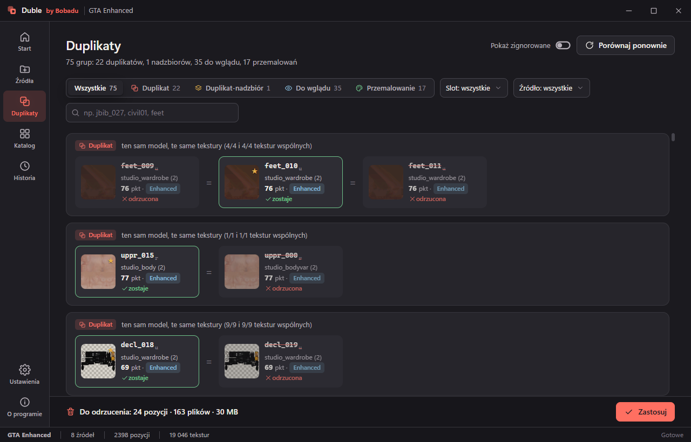

<div align="center">


# Duble

**Znajduje podwójne ubrania w paczkach do GTA V — i pozwala je posprzątać bez utraty plików.**

[](https://github.com/Bobadu/duble/actions/workflows/build.yml)
[](https://github.com/Bobadu/duble/releases/latest)
[](https://github.com/Bobadu/duble/releases)
[](LICENSE)
[](https://github.com/Bobadu/duble/releases/latest)
[](https://dotnet.microsoft.com/download)

[Pobierz](https://github.com/Bobadu/duble/releases/latest) ·
[Strona projektu](https://qorion.net/duble) ·
[Jak to działa](docs/how-it-works.md) ·
[English version](README.md)



</div>

---

Duble czyta paczki z ubraniami do GTA V (foldery, archiwa `.rpf`, zasoby FiveM), znajduje ciuchy, które są
**tym samym modelem z tymi samymi teksturami**, pokazuje je obok siebie w 2D i 3D i pozwala zdecydować, która
kopia zostaje. Nic nie znika bez Twojej decyzji: odrzucone pliki są **przenoszone** do kosza obok źródła, a jedno
kliknięcie (**Cofnij**) przywraca je z powrotem.

> **Zasada nr 1: duplikat = ten sam model + te same tekstury.** Ten sam model w innej teksturze to
> **przemalowanie** — osobny ciuch, którego Duble nigdy nie proponuje do usunięcia.

## Po co to

Biblioteka modów rośnie przez kopiowanie. Ta sama kurtka trafia do trzech paczek pod trzema numerami, paczka
wychodzi ponownie z dwiema teksturami więcej, „premium" powiela połowę darmowej. Ręcznie duplikat od
przemalowania odróżnisz tylko otwierając oba w OpenIV i patrząc. Duble porównuje odciski — modelu i każdej
tekstury — i pokazuje dowody, a nie sam werdykt.

## Co potrafi

- **Czyta oba formaty gry** — Legacy (`.ydd` v165 / `.ytd` v13) i Enhanced / gen9 (v159 / v5), a do tego zasoby
  FiveM i archiwa `.rpf`. Tekstury BC1–BC5 i BC7 są dekodowane do podglądów i odcisków.
- **Cztery werdykty, nie jeden** — duplikat, duplikat-nadzbiór, do wglądu, przemalowanie. Każdy z liczbami, na
  których się opiera (ile tekstur wspólnych, jak daleko są modele).
- **Ocena jakości (0–100)** proponuje, którą kopię zostawić — rozdzielczość, mipmapy, warianty kolorów, format
  tekstur i LOD-y, z widoczną rozpiską, żeby dało się nie zgodzić.
- **Porównanie z prawdziwego zdarzenia** — tekstury obok siebie z powiązanymi parami, duży podgląd A/B z suwakiem
  przenikania i zakładka 3D: modele obok siebie ze wspólnym obrotem albo nałożone na siebie suwakiem A→B.
- **Nic nie jest kasowane** — Zastosuj *przenosi* pliki do kosza i zapisuje Historię; Cofnij przywraca wszystko
  albo jedną pozycję. Pliki wspólne z ciuchem, który zostaje, nie są ruszane, a archiwa `.rpf` są tylko do odczytu.
- **Katalog** wszystkiego, co zaindeksowane, z filtrami (źródło, slot, format, „tylko z problemami", „w grupach").
- **Raporty** — samowystarczalny HTML z miniaturami i CSV.
- **Twoje i offline** — interfejs po polsku i angielsku, jasny/ciemny motyw, zero telemetrii, kont i internetu.

## Instalacja

1. Pobierz `Duble.exe` z [ostatniego wydania](https://github.com/Bobadu/duble/releases/latest) — jeden plik,
   ok. 60 MB, .NET w środku, bez instalatora.
2. Uruchom. SmartScreen ostrzega przed niepodpisanymi programami: **Więcej informacji → Uruchom mimo to**.
   Pierwszy start trwa kilka sekund dłużej (plik rozpakowuje się do `%TEMP%\.net\Duble\`).
3. Wymagania: Windows 10/11 (64-bit) i
   [środowisko WebView2](https://developer.microsoft.com/microsoft-edge/webview2/) — jest w Windows 11 i na
   większości maszyn z Windows 10; jeśli go brakuje, Duble powie o tym z linkiem.

Ustawienia trzymane są w `%AppData%\Bobadu\Duble\`, projekty domyślnie w `Dokumenty\Duble\`. Do każdego wydania
dołączony jest plik `Duble.exe.sha256` do sprawdzenia sumy kontrolnej.

## Jak używać

1. **Nowy projekt** — plik `.duble` z Twoimi źródłami, wynikami i decyzjami (obok folder `.duble.cache` na
   miniatury, można go skasować w każdej chwili).
2. **Źródła → dodaj** folder z paczkami, plik `.rpf` albo zasób FiveM (działa przeciąganie z Eksploratora,
   „Znajdź gry" wskaże zainstalowane GTA V). **Zaindeksuj wszystko** czyta modele i tekstury i od razu porównuje
   każdy z każdym. Kolejne indeksowanie czyta tylko to, co się zmieniło.
3. **Duplikaty** — grupy z werdyktem i powodem. Wejdź w grupę: tekstury, rozpiska jakości, 3D. Decydujesz:
   *zostaw tę*, *odrzuć*, *to nie duplikat*, notatka. Na dysku wciąż nic się nie dzieje.
4. **Zastosuj** — okno pokazuje dokładnie, które pliki i dokąd trafią. Potem Duble sam indeksuje i porównuje od nowa.
5. **Historia** — cofnij całe zastosowanie albo pojedynczą pozycję; tu też eksportujesz raport HTML i CSV.
6. **Ustawienia** — język, motyw, kosz, progi porównania i **Kalibracja**: rozkłady odległości policzone na
   Twoim katalogu, żeby było widać, czy domyślne progi pasują do Twoich paczek.

**Archiwa `.rpf` są tylko do odczytu.** Żeby posprzątać paczkę, która siedzi w archiwum, użyj
**Źródła → … → Rozpakuj do folderu**: dostajesz kopię z archiwami rozłożonymi na foldery (pliki RSC7, jak eksport
z OpenIV/CodeWalkera), którą można uporządkować i spakować własnym narzędziem.

**Po usunięciu ubrań** numeracja slotu ma dziurę (brakuje `jbib_001`). W grze to nieszkodliwe, ale `.ymt`/`.meta`
paczki dalej wymienia stare numery — odbuduj je narzędziem, którym paczka była robiona. Okno Zastosuj tłumaczy to
pod „Co to znaczy?".

## Jak działa porównanie

W skrócie: odcisk modelu (liczby + histogram kształtu + hash pozycji) rozstrzyga *ten sam mesh czy nie*; odcisk
tekstury (256-bitowy hash percepcyjny **i** siatka kolorów 8×8, oba naraz) rozstrzyga *ta sama grafika czy nie*;
pokrycie zbiorów tekstur decyduje o werdykcie: duplikat, nadzbiór, do wglądu, przemalowanie. Progi pochodzą z
kalibracji na 1132 pozycjach i 9437 teksturach, a Ustawienia → Kalibracja powtarzają ten pomiar na Twoich danych.

Pełne uzasadnienie z pomiarami: **[docs/how-it-works.md](docs/how-it-works.md)** (po angielsku).

## Budowanie ze źródeł

Wymagania: Windows, [.NET 10 SDK](https://dotnet.microsoft.com/download), git.

```powershell
git clone https://github.com/Bobadu/duble
cd duble
.\build.ps1            # klonuje CodeWalker (przypięty commit) obok repo, buduje Release, uruchamia testy
.\build.ps1 -Publish   # jeden plik publish\Duble.exe (self-contained, win-x64)
.\build.ps1 -Uruchom   # build i start w trybie deweloperskim (interfejs z folderu ui\, DevTools)
```

| Projekt | Co to |
|---|---|
| `Duble.Core` | silnik: indeksowanie, odciski, porównanie, decyzje, zastosuj/cofnij, raport, rozpakowanie |
| `Duble.App` | powłoka WPF + WebView2; cały interfejs siedzi w `Duble.App/ui` (HTML/CSS/JS, three.js) |
| `Duble.Cli` | linia poleceń: `duble indeks / porownaj / raport / zastosuj / cofnij / kalibruj` |
| `Duble.Tests` | testy xunit; te, które potrzebują prawdziwych paczek, pomijają się same przy braku danych |

Pull requesty mile widziane — zasady w [CONTRIBUTING.md](CONTRIBUTING.md) (jedna z nich: kod pisany jest po
polsku), historia zmian w [CHANGELOG.md](CHANGELOG.md).

## Podziękowania

Duble stoi na [CodeWalker.Core](https://github.com/dexyfex/CodeWalker) autorstwa dexyfexa (czytanie `.rpf` /
`.ydd` / `.ytd`), [BCnEncoder.Net](https://github.com/Nominom/BCnEncoder.NET) (dekodowanie BC7) i
[three.js](https://threejs.org) (podgląd 3D). Dziękujemy.

## Licencja

[MIT](LICENSE) © 2026 Bobadu.
